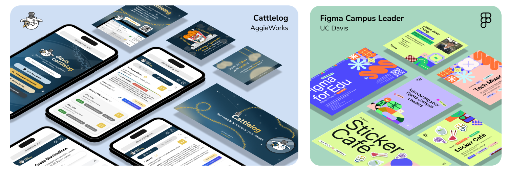

  

# Heyo, I'm Jason Zhang! 👋

### 🎨 Product Designer  |  🛠️ Design Engineer  |   Campus Leader

Building user-focused products with a focus on data-driven design.

<mark>*"You can just make things."*</mark>

## 🛠️ Tech Stack

### 🎨 Design & Development

  
  
  
  
  
  

### 🌐 Web Tech

  
  
  
  
  
  
  
  

### ⚙️ Systems & Languages

  
  
  
  
  

### Data & Infrastructure

  
  
  

## Projects

### 🐮 [Cattlelog](https://daviscattlelog.com)
*A UC Davis course and professor catalog reaching 25,000 students.*
- 🛠️ **Role** | Product Designer & Front-end Developer
- 📈 **Impact** | Constructed the design system and branding guidelines; helping 30,000+ students at UC Davis make better course schedule decisions.
- 💻 **Stack** | React, Tailwind CSS, TypeScript, Vite.

### 📊 [Fimanu](https://figma-tracker-production.up.railway.app/)
*An interactive dashboard displaying real-time Figma file edit history as a contribution heatmap.*

- 🛠️ **Role** | Full-Stack Developer & Designer
- 📈 **Impact** | Integrated Figma OAuth and Supabase to visualize design velocity and contribution history.
- 💻 **Stack** | React, Figma API, Supabase, Railway, Vite.

## Can't Wait to Chat!

-  &nbsp; [linkedin.com/in/jasonjiayuzhang](https://linkedin.com/in/jasonjiayuzhang)
-  &nbsp; [jjz.figma.site](https://jjz.figma.site)
-  &nbsp; [jason.jiayu.zhang@gmail.com](mailto:jason.jiayu.zhang@gmail.com)

<mark>*"To nurture others fall to in love with the art of making as I have fallen."*</mark>

<!--
**jason-jiayu-zhang/jason-jiayu-zhang** is a ✨ _special_ ✨ repository because its `README.md` (this file) appears on your GitHub profile.

Here are some ideas to get you started:

- 🔭 I’m currently working on ...
- 🌱 I’m currently learning ...
- 👯 I’m looking to collaborate on ...
- 🤔 I’m looking for help with ...
- 💬 Ask me about ...
- 📫 How to reach me: ...
- 😄 Pronouns: ...
- ⚡ Fun fact: ...
-->
